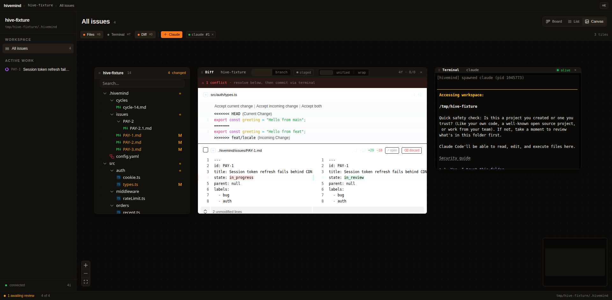
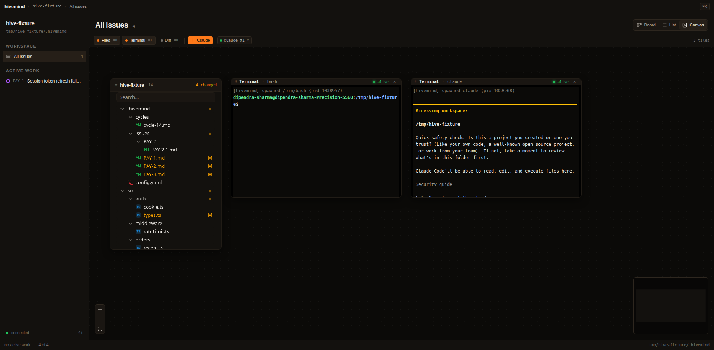
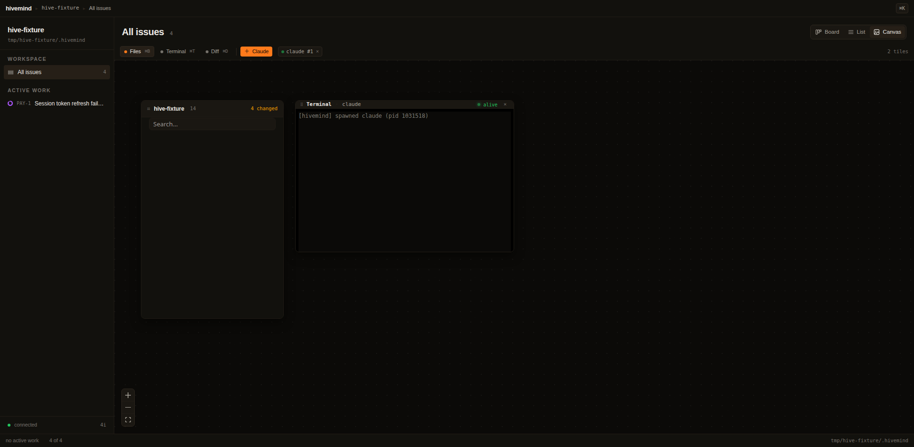
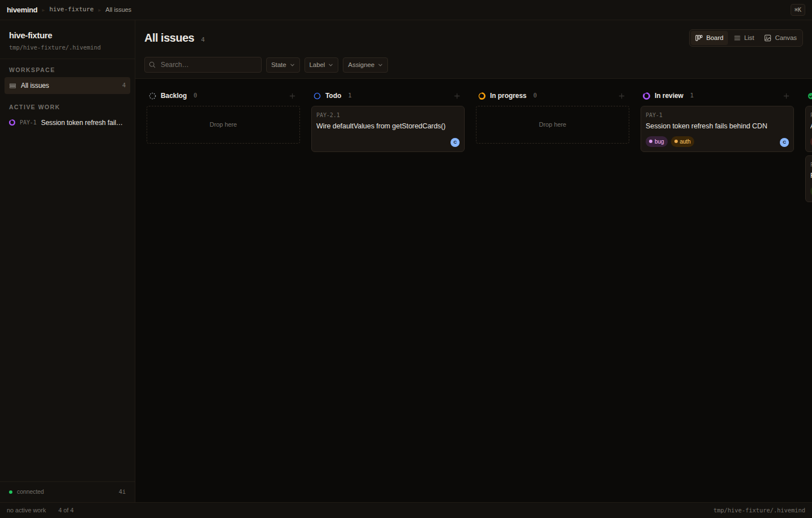
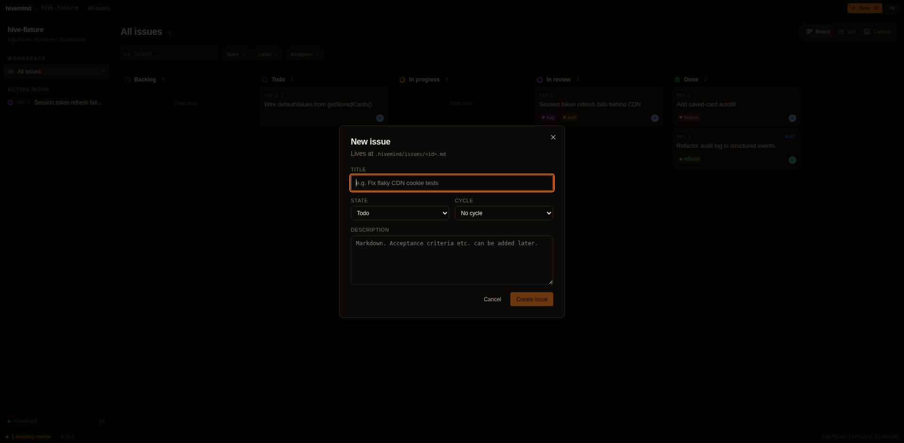

# hivemind

> A canvas-per-project mission control for AI coding agents. Drop `claude`,
> `codex`, `gemini`, or `opencode` into real workspaces where they can read
> issues, update status, mark acceptance criteria, and comment their own
> progress — through a Plane-style PM model that's just plain markdown on disk.

[](./LICENSE)
[](#install)
[](#)
[](https://pnpm.io)

Local-first. Markdown-backed. No SDK lock-in. No telemetry. No cloud.

---

## Demo

> One infinite canvas per repo. Every tile is live — terminals running agents,
> a diff that updates as they edit, a file tree, an issues board. Group them
> into **frames** (workspaces), bind each frame to a local repo, a git worktree,
> or a **remote SSH host**, and watch several agents work in parallel.

<p align="center">
  
</p>

<table>
  <tr>
    <td width="50%"><br/><sub><b>Agents in parallel</b> — each in its own PTY tile, status dots live on the frame header.</sub></td>
    <td width="50%"><br/><sub><b>Editor + tree + agent</b> — open files, see edits land in the diff next door.</sub></td>
  </tr>
  <tr>
    <td width="50%"><br/><sub><b>Issues board</b> — Plane-style cards backed by plain markdown on disk.</sub></td>
    <td width="50%"><br/><sub><b>Create an issue</b> — then hand it to an agent with one click (<b>▶ Work on this</b>).</sub></td>
  </tr>
</table>

**60-second tour**

1. `hivemind .` in any repo → an infinite canvas opens, scoped to that project.
2. Press `⌘\` → a `claude` tile spawns in the frame, running in the repo's `cwd`.
3. Click **▶ Work on this** on an issue → the agent spawns pre-loaded with the
   issue and the full MCP tool surface; it works, you watch the diff update live.
4. Click a frame's **worktree** button to spin a branch into a nested sub-frame,
   or **remote** to bind the frame to a directory on an SSH host — the same
   terminals, editor, and diff, now running on that machine.

---

## Contents

[What it is](#what-it-is) · [Install](#install) · [Quick start](#quick-start) · [Features](#features) · [Architecture](#architecture) · [Development](#development) · [Contributing](#contributing) · [License](#license)

---

## What it is

A desktop app — Electron + an infinite [xyflow](https://reactflow.dev) canvas — where every tile is a live terminal, a code diff, a file tree, or an issues board, and every tile belongs to a **frame** (a named workspace bound to a real repo on disk). Spawn a `claude` inside a frame: it runs in that repo's `cwd`, sees that repo's issues, and writes changes that show up live in the diff tile next door.

The terminals survive everything:

- **Window close / app quit** → PTY keeps running in a detached daemon, replay on reopen via headless [xterm.js](https://xtermjs.org) snapshot (Mosh-style coalesced state — alt-screen for vim/htop, SGR colors, cursor — not a fast-forward of raw bytes).
- **Reboot** → claude sessions are bound to a hivemind-generated UUID at spawn (`--session-id <uuid>`). After reboot the daemon respawns claude with `--resume <uuid>` so the prior conversation continues, not a fresh one.
- **Layout** → frames, tile positions, viewport pan/zoom, editor tabs all persist per-repo in `localStorage` and restore on next open.

---

## Install

Linux x86_64 only for now. **No build toolchain needed** — the installer downloads prebuilt binaries from the latest [GitHub Release](https://github.com/dip497/hivemind/releases).

```bash
bash <(curl -fsSL https://raw.githubusercontent.com/dip497/hivemind/main/install.sh)
```

The script will:

1. Resolve the latest release tag from GitHub.
2. Download the `hive` CLI single-binary and the Electron AppImage into `~/.hivemind-app/`.
3. Symlink them into `~/.local/bin/` (`hive`, `hivemind`).
4. Verify `claude` is on PATH (warning only — desktop app runs without it).

Re-run anytime to upgrade — the installer is a no-op if you're already on the latest tag, otherwise downloads + relinks. Pin a specific version with `HIVEMIND_VERSION=v0.1.0 bash <(curl …)`.

### Build from source (hackers)

If you want to hack on hivemind or run pre-release code:

```bash
bash <(curl -fsSL https://raw.githubusercontent.com/dip497/hivemind/main/install.sh) --dev
# or:
git clone https://github.com/dip497/hivemind.git
cd hivemind
./install.sh --dev
```

Requires `git`, `node` ≥ 22, `pnpm` ≥ 10, `bun` ≥ 1.1. Set `HIVEMIND_SKIP_APPIMAGE=1` to skip the slow electron-builder step (the CLI still installs).

---

## Quick start

```bash
# 1. Initialize hivemind inside a git repo
cd ~/my-project
hive init --prefix MYP
hive init --agentic        # adds .mcp.json + .claude/skills/hive-work/SKILL.md + CLAUDE.md

# 2. Create an issue
hive new "Fix token expiry comparison"
# → writes .hivemind/issues/MYP-1.md

# 3. Launch the canvas
hivemind .
```

In the canvas:

- Press `⌘\` to spawn a claude tile in the active workspace zone.
- Click **▶ Work on this** on any issue → claude spawns pre-loaded with the issue and the full MCP tool surface.
- Drag a file from the explorer tile into the diff tile to pin a review.
- Press `7` to open a **Browser** tile — a real web view that pans/zooms with the canvas.
- Double-click any tile name to rename it; the pencil icon opens edit mode.

---

## Features

| | |
|---|---|
| **Canvas-per-project** | One infinite canvas per repo. Frames bind to a workspace path so multiple repos can coexist on one screen. Each frame auto-gets a distinct color. |
| **First-class agents** | claude / codex / gemini / opencode each run in their own xterm tile with WebGL-accelerated rendering. |
| **Browser tile** | A real Chromium web view (Electron `<webview>`) that lives in the DOM, so it pans / zooms / clips with the canvas — multi-tab, address bar, find-in-page, per-session logins. Press `7` or a frame's **+ → Browser**. |
| **Agents can browse** | Opt-in (`HIVEMIND_BROWSER_CDP=1`): a spawned agent drives the *visible* Browser tile over CDP via the `hive-browser` skill (built on [agent-browser](https://github.com/vercel-labs/agent-browser)) — navigate, click, read, screenshot the same page you're watching. |
| **Remote SSH frames** | Bind a frame to a directory on another machine over SSH — its terminals are real PTYs on the host, the editor reads/writes over SFTP, diff/status run `git` on the remote. One pooled `ssh2` connection per host; agent/key auth; TOFU host keys. |
| **Git worktrees as sub-frames** | Attach a branch worktree → a nested sub-frame scoped to that branch. Line several branches up side by side and arrange them as columns. |
| **Layers + arrange** | A Figma-style layers rail lists every tile grouped by frame with live status; opt-in arrange snaps a frame's tiles + worktrees into Columns / Rows / Grid. |
| **PM you can `cat`** | Issues, cycles, activity log are markdown files with YAML frontmatter under `.hivemind/`. No DB, no API. |
| **MCP integration** | `.mcp.json` autowires a 9-tool stdio MCP server so claude can `get_issue`, `set_state`, `add_comment`, `mark_acceptance` etc. directly from inside its tile. |
| **Persistent terminals** | Detached PTY daemon survives the window. Headless xterm + SerializeAddon for replay. Disk snapshots for reboot survival. |
| **Reboot-resume for claude** | Every claude spawn is `--session-id`-bound at spawn time. After reboot, daemon respawns with `--resume <uuid>` — same conversation. |
| **Persistent layout** | Frames, sizes, positions, viewport, editor tabs — all per-repo, restored on reopen. |
| **Plane-style PM** | Project / issue / acceptance criteria / cycles / activity log — the bits that mattered. |

---

## Architecture

```text
.hivemind/                                # in YOUR repo
├── issues/      <ID>.md (YAML frontmatter)  ← single source of truth
├── cycles/      sprint definitions
└── config.yaml  workspace prefix, next id

apps/
├── cli/         hive CLI (citty + bun-compile). Hosts the MCP server via
│                 `hive mcp-stdio`.
└── desktop/     Electron + electron-vite + React renderer.
                 ├─ Canvas       xyflow infinite canvas
                 ├─ TerminalTile xterm.js + WebGL + agent-status bus
                 ├─ BrowserTile  multi-tab <webview> + CDP agent bridge
                 ├─ DiffTile     Pierre-backed diff view
                 ├─ FileTreeTile project explorer
                 ├─ EditorTile   CodeMirror tabs
                 ├─ IssuesTile   Plane-style cards
                 ├─ FrameNode    workspace zones (bind repo / worktree / remote)
                 ├─ LayersPanel  Figma-style tile rail grouped by frame
                 ├─ main/remote/ ssh2 transport — remote PTY + SFTP + git
                 └─ pty-daemon   detached node-pty + headless-xterm snapshots

packages/
├── hive-core/   storage + parsing (gray-matter + zod schemas)
├── hive-mcp/    stdio MCP server (9 tools wrapping hive-core)
└── tsconfig/    shared TS config

templates/
└── agentic/     per-workspace templates copied by `hive init --agentic`
```

### How claude talks to hivemind

1. `hive init --agentic` drops `.mcp.json`, `CLAUDE.md`, and the `hive-work` skill into your repo.
2. You start `claude` (in a canvas tile or any terminal) inside that repo.
3. claude auto-loads `.mcp.json` → spawns `hive mcp-stdio` over stdio → gets `mcp__hive__get_issue`, `set_state`, `add_comment`, `mark_acceptance`, …
4. The skill auto-activates on any `MYP-123` mention and runs claude through the **Execution Contract**: load issue → do work → end every session with `mcp__hive__set_state(disposition)`.

State changes go through MCP → markdown files → filesystem watcher → live UI. No SDK, no API key. claude uses your existing `claude` CLI login (Pro / Max / API).

### Persistence model

| Event | PTY survives | Visible screen | Claude conversation |
|---|---|---|---|
| Close window / quit Electron | ✅ daemon detached | ✅ live stream | ✅ same process |
| `pkill electron` | ✅ | ✅ | ✅ |
| Daemon killed | ❌ respawned with new PTY | ✅ replayed from disk | ✅ via `--resume <uuid>` |
| Reboot | ❌ | ✅ replayed from disk | ✅ via `--resume <uuid>` |
| `×` on tile | ❌ explicit kill | ❌ snapshot evicted | ❌ done |

Anchored against `anthropics/claude-code`'s actual semantics — see [`apps/desktop/src/main/pty-daemon.ts`](./apps/desktop/src/main/pty-daemon.ts) for the bind/restore wiring with citations.

---

## Development

```bash
git clone https://github.com/dip497/hivemind.git
cd hivemind
pnpm install

# Renderer + dev-bridge (browser dev loop — fastest)
pnpm --filter @hivemind/desktop run dev:bridge -- /path/to/test/repo
# then open http://localhost:5180/

# Or run the full Electron app (auto-reload on rebuild)
pnpm --filter @hivemind/desktop run dev

# CLI in dev (no compile)
pnpm --filter @hivemind/cli run dev <subcommand>

# Tests
pnpm --filter @hivemind/desktop run test:unit       # node:test, fast
pnpm --filter @hivemind/desktop run test:e2e        # playwright + xvfb

# Typecheck
pnpm --filter @hivemind/desktop run typecheck
```

**Hard rule:** the dev-bridge must run under `tsx` (node), NOT `bun`. Bun's
loader silently drops `@lydell/node-pty` output on Linux. The dev-bridge
self-guards against accidental bun startup.

### Prior art

| From | Pattern borrowed |
|---|---|
| [Plane](https://plane.so) | workspace > project > issue > acceptance criteria + cycles + activity log |
| [tldraw](https://tldraw.com) / Figma | infinite canvas with frame-as-workspace, snap-to-grid, momentum pan |
| [tmux](https://github.com/tmux/tmux) / [mosh](https://mosh.org) | tmux-style detach-keeps-alive; Mosh-style coalesced state replay (current screen, not raw byte tail) |
| Unreal Blueprint | comment-box "Frame" nodes to group canvas tiles |
| [Pierre](https://pierre.co) | first-class diff + tree components inside the canvas |

---

## Contributing

PRs welcome. Areas that would benefit:

- **macOS / Windows support** — currently Linux-only because of `@lydell/node-pty` build + AppImage packaging. Should be straightforward.
- **More agents** — adapters/skills for `codex`, `gemini`, `opencode` beyond the claude integration.
- **Reboot resume for non-claude agents** — `pty-daemon.ts`'s `transformSpecOnSpawn` / `transformSpecOnRestore` accepts arbitrary transforms; wire up your agent's resume semantics there.
- **Tests** — the `tests/unit` (node:test) and `tests/e2e` (Playwright) suites are the place to pin behavior. Drag/perf and persistence are well covered; agent-status detection less so.

Open an issue first if the change is non-trivial. Match the project's coding style: TypeScript strict, comments document **why** (especially load-bearing trade-offs), no emoji in code, lucide-react icons only.

---

## License

[MIT](./LICENSE) — © 2026 hivemind contributors.
