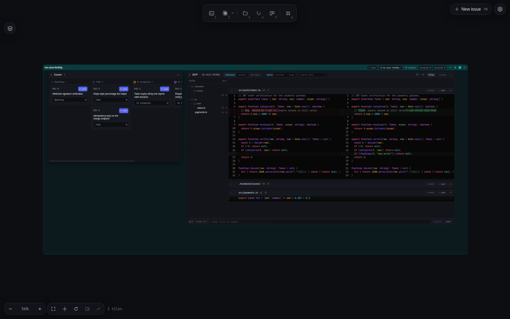
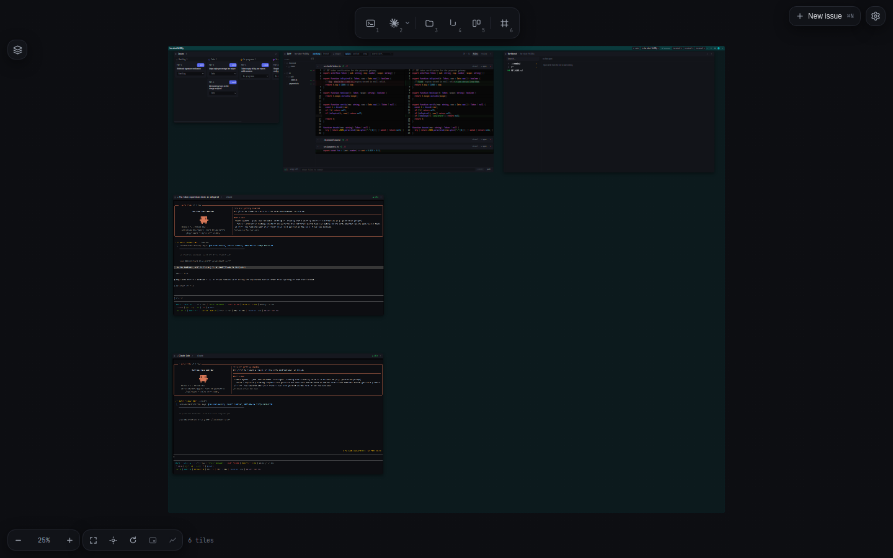
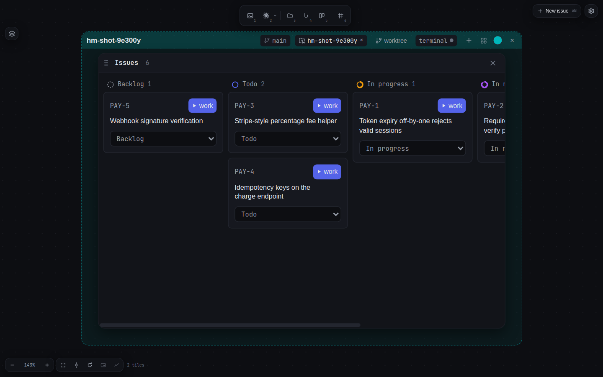
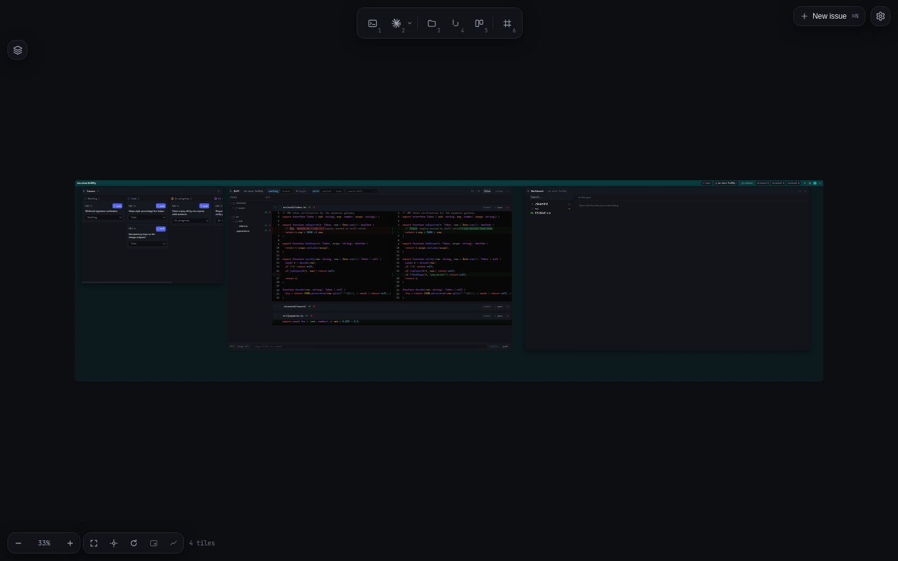
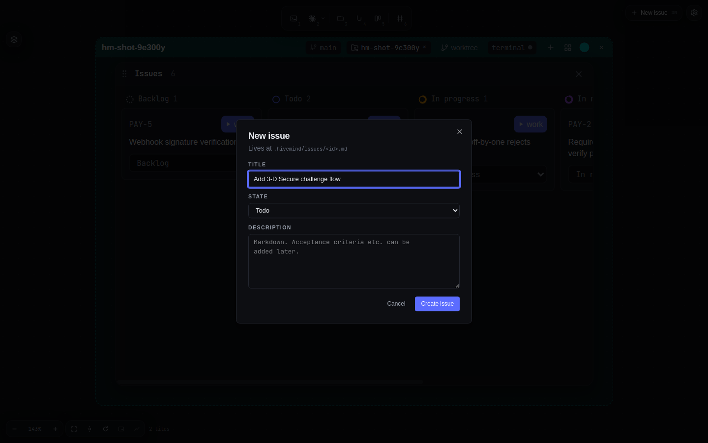

<div align="center">


# hivemind

**A canvas-per-project mission control for AI coding agents.**

Drop `claude`, `codex`, `gemini`, or `opencode` into real workspaces where they can
read issues, update status, mark acceptance criteria, and comment their own
progress — through a Plane-style PM model that's just plain markdown on disk.

[](./LICENSE)
[](#install)
[](https://github.com/dip497/hivemind/releases)
[](#)

Local-first · Markdown-backed · No SDK lock-in · No telemetry · No cloud.

<br/>



<sub>An issue board and the live diff of a fix, side by side on one infinite canvas. The agent edits; the diff updates as you watch.</sub>

</div>

---

## Contents

[Why](#why) · [The whole canvas](#the-whole-canvas) · [Install](#install) · [Quick start](#quick-start) · [How agents talk to hivemind](#how-agents-talk-to-hivemind) · [Features](#features) · [Architecture](#architecture) · [Persistence](#persistence-model) · [Development](#development) · [Contributing](#contributing)

---

## Why

Running a coding agent in a bare terminal throws away everything around the work.
You lose track of *which* task it's on, you can't see its edits without `git diff`,
the conversation dies when you close the window, and the moment you want a second
agent on a second branch you're juggling tmux panes.

hivemind makes the **project** the unit of work, not the terminal. One infinite
canvas per repo. Every tile on it is live — a terminal running an agent, a diff
that updates as the agent edits, a file tree, a code editor, an issues board, even
a real web browser. Group tiles into **frames** (named workspaces), bind each frame
to a local repo, a git **worktree**, or a **remote SSH host**, and watch several
agents work in parallel — each scoped to its own directory, issues, and branch.

The project-management layer underneath is deliberately boring: issues, acceptance
criteria, cycles, and an activity log are **plain markdown files with YAML
frontmatter** under `.hivemind/`. No database, no API, no account. An agent reads
and writes them through a small MCP server, so it can pick up an issue, flip its
state, tick acceptance criteria, and comment its progress — and you see all of it
land live in the board tile.

---

## The whole canvas

<div align="center">

</div>

<table>
  <tr>
    <td width="50%"><br/><sub><b>Issues board</b> — Plane-style cards across Backlog → Todo → In&nbsp;progress → In&nbsp;review → Done. Each card is one markdown file you can <code>cat</code>.</sub></td>
    <td width="50%"><br/><sub><b>Explorer + diff</b> — browse the tree, open files in the editor, and review changes in the Pierre-backed diff — all on the same canvas.</sub></td>
  </tr>
  <tr>
    <td width="50%"><br/><sub><b>Live diff</b> — split or unified, changed-files sidebar, per-file <b>reviewed</b> checks, line comments you can send straight to an agent.</sub></td>
    <td width="50%"><br/><sub><b>Create an issue</b> — it lives at <code>.hivemind/issues/&lt;id&gt;.md</code>, then hand it to an agent with <b>▶ Work</b>.</sub></td>
  </tr>
</table>

**60-second tour**

1. `hivemind .` in any repo → an infinite canvas opens, scoped to that project.
2. Press `2` (or a frame's **+**) → an agent tile spawns, running in the repo's `cwd`.
3. Click **▶ Work** on an issue → the agent spawns pre-loaded with that issue and the
   full MCP tool surface; it works, you watch the diff update live.
4. Click a frame's **worktree** button to spin a branch into a nested sub-frame, or
   **remote** to bind the frame to a directory on an SSH host — same terminals,
   editor, and diff, now running on that machine.

---

## Install

Linux x86_64 only for now. **No build toolchain needed** — the installer downloads
prebuilt binaries from the latest [GitHub Release](https://github.com/dip497/hivemind/releases).

```bash
bash <(curl -fsSL https://raw.githubusercontent.com/dip497/hivemind/main/install.sh)
```

The script will:

1. Resolve the latest release tag from GitHub.
2. Download the `hive` CLI single-binary and the Electron AppImage into `~/.hivemind-app/`.
3. Symlink them into `~/.local/bin/` as `hive` and `hivemind`.
4. Check that an agent CLI (`claude`, `codex`, …) is on `PATH` (warning only).

Re-run anytime to upgrade — it's a no-op if you're already on the latest tag. Pin a
version with `HIVEMIND_VERSION=v1.0.0 bash <(curl …)`.

<details>
<summary><b>Build from source</b></summary>

```bash
git clone https://github.com/dip497/hivemind.git
cd hivemind
./install.sh --dev
```

Requires `git`, `node` ≥ 22, `pnpm` ≥ 10, `bun` ≥ 1.1. Set `HIVEMIND_SKIP_APPIMAGE=1`
to skip the slow electron-builder step (the CLI still installs).
</details>

---

## Quick start

```bash
# 1. Initialize hivemind inside a git repo
cd ~/my-project
hive init --prefix MYP        # writes .hivemind/config.yaml
hive init --agentic           # adds .mcp.json + .claude/skills/ + CLAUDE.md

# 2. Create an issue
hive new "Fix token expiry comparison"
# → writes .hivemind/issues/MYP-1.md

# 3. Launch the canvas
hivemind .
```

In the canvas:

- Press `2` to spawn the selected agent; the tool island (top) switches agent and
  the number keys `1`–`7` spawn terminal / agent / explorer / diff / issues / frame / browser.
- Click **▶ Work** on any issue → the agent spawns pre-loaded with the issue and the
  full MCP tool surface.
- Press `⌘L` to toggle the **Layers** panel — every tile grouped by frame, with live
  agent status.
- Press `7` for a **Browser** tile — a real web view that pans and zooms with the canvas.
- Double-click a tile's name to rename it.

---

## How agents talk to hivemind

```text
agent tile (claude / codex / …)
      │  reads .mcp.json, spawns the server over stdio
      ▼
hive mcp-stdio  ──►  get_issue · set_state · add_comment · mark_acceptance · …
      │  edits markdown
      ▼
.hivemind/issues/*.md  ──►  filesystem watcher  ──►  live board tile
```

1. `hive init --agentic` drops `.mcp.json`, `CLAUDE.md`, and the `hive-work` skill
   into your repo.
2. You start an agent (in a canvas tile or any terminal) inside that repo.
3. The agent auto-loads `.mcp.json`, spawns `hive mcp-stdio`, and gets the hive tools:
   `get_issue`, `set_state`, `add_comment`, `mark_acceptance`, and friends.
4. The skill activates on any `MYP-123` mention and runs the agent through an
   **execution contract**: load the issue → do the work → end the session by setting
   the issue's disposition.

State changes flow MCP → markdown → filesystem watcher → live UI. No SDK, no API key.
Agents use your existing CLI login.

---

## Features

| | |
|---|---|
| **Canvas-per-project** | One infinite [xyflow](https://reactflow.dev) canvas per repo. Frames bind to a workspace path, so multiple repos coexist on one screen, each with its own auto-assigned color. |
| **Pluggable agents** | `claude` / `codex` / `gemini` / `opencode` each run in their own WebGL-accelerated xterm tile. Agents are an extensible registry — adding one is a single entry. Live status (idle / working / waiting / done) is detected from the command and shown on the frame header. |
| **Plane-style PM you can `cat`** | Issues, acceptance criteria, cycles, and an activity log are markdown + YAML frontmatter under `.hivemind/`. No DB, no API. |
| **MCP integration** | `.mcp.json` autowires a stdio MCP server so agents can `get_issue`, `set_state`, `add_comment`, `mark_acceptance`, … from inside their tile. |
| **Live diff review** | A Pierre-backed diff tile: split / unified, a changed-files sidebar with per-file **reviewed** checks, multi-line comments, and **send-to-agent** for any comment or selection. |
| **Git worktrees as sub-frames** | Attach a branch worktree → a nested sub-frame scoped to that branch. Line several branches up side by side and arrange them as columns. |
| **Remote SSH frames** | Bind a frame to a directory on another machine over SSH — its terminals are real PTYs on the host, the editor reads/writes over SFTP, diff/status run `git` on the remote. One pooled `ssh2` connection per host; agent / key / password auth; TOFU host keys. |
| **Browser tile** | A real Chromium web view (Electron `<webview>`) that lives in the DOM, so it pans / zooms / clips with the canvas — multi-tab, address bar, find-in-page, per-session logins. |
| **Agents can browse** | Opt-in: a spawned agent drives the *visible* Browser tile over CDP via the `hive-browser` skill (built on [agent-browser](https://github.com/vercel-labs/agent-browser)) — navigate, click, read, screenshot the same page you're watching. |
| **Layers + arrange** | A Figma-style layers rail lists every tile grouped by frame with live status; opt-in arrange snaps a frame's tiles and worktrees into Columns / Rows / Grid. |
| **Persistent terminals** | A detached PTY daemon outlives the window. Headless xterm + SerializeAddon replays the *current screen* (alt-screen, SGR colors, cursor) on reopen — not a raw byte fast-forward. |
| **Reboot-resume** | Every `claude` spawn is `--session-id`-bound at spawn time; after a reboot the daemon respawns with `--resume <uuid>`, continuing the same conversation. Codex resumes from its session dir. |
| **Persistent layout** | Frames, sizes, positions, viewport pan/zoom, and editor tabs persist per-repo and restore on reopen. |

---

## Architecture

```text
.hivemind/                                # in YOUR repo
├── issues/      <ID>.md (YAML frontmatter)  ← single source of truth
├── cycles/      sprint definitions
└── config.yaml  workspace prefix, next id

apps/
├── cli/         hive CLI (citty + bun-compile). Hosts the MCP server via
│                 `hive mcp-stdio`.
└── desktop/     Electron + electron-vite + React renderer.
                 ├─ Canvas       xyflow infinite canvas
                 ├─ TerminalTile xterm.js + WebGL + agent-status bus
                 ├─ DiffTile     Pierre-backed diff + review
                 ├─ EditorTile   CodeMirror tabs
                 ├─ FileTreeTile project explorer
                 ├─ IssuesTile   Plane-style board
                 ├─ BrowserTile  multi-tab <webview> + CDP agent bridge
                 ├─ FrameNode    workspace zones (repo / worktree / remote)
                 ├─ LayersPanel  Figma-style rail grouped by frame
                 ├─ main/remote/ ssh2 transport — remote PTY + SFTP + git
                 └─ pty-daemon   detached node-pty + headless-xterm snapshots

packages/
├── hive-core/   storage + parsing (gray-matter + zod schemas)
├── hive-mcp/    stdio MCP server wrapping hive-core
└── tsconfig/    shared TS config

templates/
└── agentic/     per-workspace templates copied by `hive init --agentic`
```

---

## Persistence model

| Event | PTY survives | Visible screen | Agent conversation |
|---|---|---|---|
| Close window / quit Electron | ✅ daemon detached | ✅ live stream | ✅ same process |
| `pkill electron` | ✅ | ✅ | ✅ |
| Daemon killed | ❌ respawned | ✅ replayed from disk | ✅ via `--resume <uuid>` |
| Reboot | ❌ | ✅ replayed from disk | ✅ via `--resume <uuid>` |
| `×` on tile | ❌ explicit kill | ❌ snapshot evicted | ❌ done |

Anchored against `anthropics/claude-code`'s actual resume semantics — see
[`apps/desktop/src/main/pty-daemon.ts`](./apps/desktop/src/main/pty-daemon.ts) for the
bind/restore wiring.

---

## Development

```bash
git clone https://github.com/dip497/hivemind.git
cd hivemind && pnpm install

# Full Electron app (auto-reload on rebuild)
pnpm --filter @hivemind/desktop run dev

# Renderer-only dev loop (fastest) — open http://localhost:5180/
pnpm --filter @hivemind/desktop run dev:bridge -- /path/to/test/repo

# CLI in dev
pnpm --filter @hivemind/cli run dev <subcommand>

# Tests + typecheck
pnpm --filter @hivemind/desktop run test:unit    # node:test, fast
pnpm --filter @hivemind/desktop run test:e2e     # playwright + xvfb
pnpm --filter @hivemind/desktop run typecheck
```

**Hard rule:** the dev-bridge must run under `tsx` (node), **not** `bun` — Bun's loader
silently drops `@lydell/node-pty` output on Linux. The dev-bridge self-guards against
accidental bun startup.

### Prior art

| From | Pattern borrowed |
|---|---|
| [Plane](https://plane.so) | workspace → project → issue → acceptance criteria + cycles + activity log |
| [tldraw](https://tldraw.com) / Figma | infinite canvas with frame-as-workspace, momentum pan |
| [tmux](https://github.com/tmux/tmux) / [mosh](https://mosh.org) | detach-keeps-alive; coalesced state replay (current screen, not raw byte tail) |
| Unreal Blueprint | comment-box "Frame" nodes to group canvas tiles |
| [Pierre](https://pierre.co) | first-class diff + tree components inside the canvas |

---

## Contributing

PRs welcome. High-value areas:

- **macOS / Windows support** — currently Linux-only because of `@lydell/node-pty`
  build + AppImage packaging.
- **More agents** — the registry (`apps/desktop/src/renderer/src/agents.tsx`) takes one
  entry per agent; wire status detection + resume semantics.
- **Reboot-resume for non-claude agents** — `pty-daemon.ts`'s
  `transformSpecOnSpawn` / `transformSpecOnRestore` accept arbitrary transforms.

Open an issue first if the change is non-trivial. Style: TypeScript strict, comments
explain **why**, no emoji in code, lucide-react icons only.

---

## License

[MIT](./LICENSE) — © 2026 hivemind contributors.
