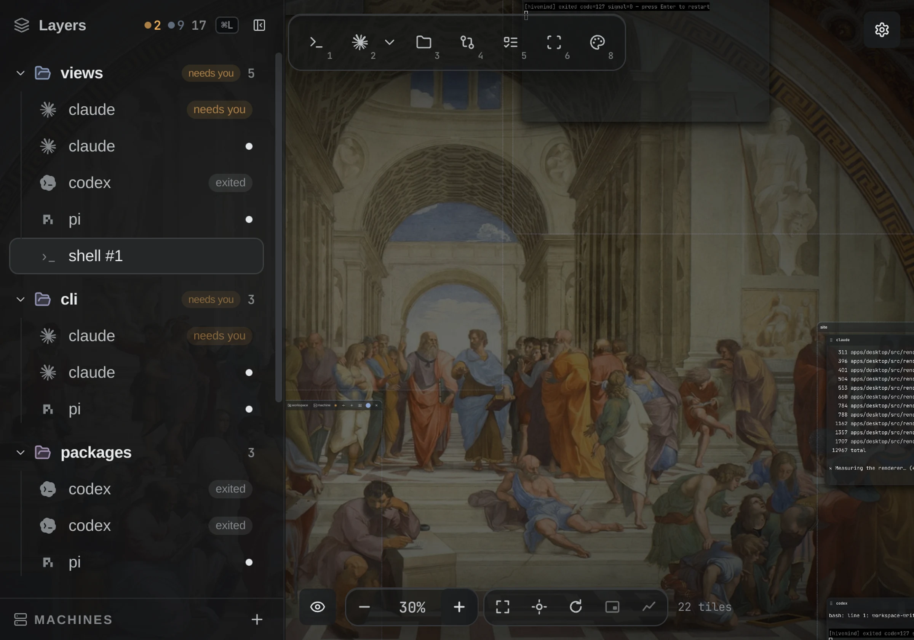

<p align="center">
  
</p>

<h1 align="center">hivemind</h1>

<p align="center"><b>Build the workspace your agents work in.</b><br />The screen is yours to draw; we keep the agents, terminals and diffs alive inside it.</p>

<p align="center">
  <a href="https://hivemind.griiken.com/">site</a> ·
  <a href="https://hivemind.griiken.com/guide/">docs</a> ·
  <a href="https://github.com/dip497/hivemind/releases">releases</a> ·
  <a href="https://hivehub.griiken.workers.dev/">plugins</a>
</p>

> *Four agents, four terminals, four tabs.* One is waiting for approval, one finished ten
> minutes ago, one is editing a file you meant to read first — and you find out by cycling
> through windows.

One screen instead. Each agent's terminal, the diff it is editing, the issues, a browser —
grouped into frames bound to a repo, a worktree or an SSH host.

- **Agents run agents.** `hive ctl` is on every agent's PATH, so one spawns three more, watches
  them work, reads their answers and approves their tools — while you watch all four.
- **The screen itself is a plugin.** Don't like this canvas? Write the one you want — a queue, a
  subway map, a Mars base — with the real, running terminals inside it.



<sub>The canvas — one frame per repository, tiles inside them.</sub>

---

## Install

```bash
bash <(curl -fsSL https://hivemind.griiken.com/install.sh)
```

On Windows, in PowerShell:

```powershell
irm https://hivemind.griiken.com/install.ps1 | iex
```

Linux x86_64, macOS Apple Silicon and Windows x64 have prebuilt releases, so you need no
toolchain; Intel macs and Linux arm64 build from source with `--dev`. Re-run it to upgrade,
or pin a version with `HIVEMIND_VERSION=v2026.9.1`.

## Use

```bash
cd ~/my-project
hive init --prefix MYP          # .hivemind/config.yaml + the agent skills
hive new "Fix token expiry comparison"
hivemind .
```

`1`–`7` spawn a terminal, an agent, an explorer, a diff, the issues board, a frame or a
browser. Click **Work** on an issue and the agent starts with that issue and the `hive`
skills loaded. `⌘B` opens the layers rail, `⌘E` switches view — the keys follow VS Code (Settings → Shortcuts).

## What you get

| | |
|---|---|
| **Agents you already have** | no agent ships in the app: the ones whose CLI is on your machine are added from [HiveHub](https://hivehub.griiken.workers.dev/), and a notice says what each can do |
| **Status you can see** | working, finished, or waiting for you — read from the agent's own screen, so it needs no cooperation |
| **Terminals that outlive the window** | a detached daemon keeps them running and replays the screen on reopen; a session resumes after a reboot |
| **Issues as files in your repo** | markdown with YAML frontmatter under `.hivemind/`; no database, no account |
| **Agents driving agents** | `hive ctl` is on every agent's PATH, so one agent spawns three more, reads their replies and approves their tools — see below |
| **Views and plugins** | the canvas is one view; install another from HiveHub or write one against a sandboxed API with no files, network or app access |

Works with **Claude Code · Codex · Cursor · Droid · Kiro · pi · Gemini · opencode** and a
dozen more.

## One agent, running the others

Every verb the canvas has is a command, and `hive ctl` is on the PATH of every agent you
start. So an agent can use it on other agents — spawn them, watch them, decide for them.

```bash
hive ctl spawn --agent codex --name migrate --prompt "Port the auth module to the new API"
hive ctl stream tile-codex-123                 # watch it work, live
hive ctl read tile-codex-123                   # wait for its answer, use it
hive ctl workflow --shape fanout --items "api||web||cli" --prompt "Upgrade {item} to node 24"
hive ctl connect tile-a tile-b                 # a's replies become b's input
hive ctl spawn --agent claude --supervise all  # it asks you before every tool; you allow or deny
```

Your lead agent writes the plan, fans it out to three workers, reads what comes back and
merges it — while you watch all four tiles and take one over whenever you want. Nothing to
install for it: no MCP server, just a local `0600` socket.

## Build the workspace you actually want

Nobody agrees what a workspace should look like — so we stopped deciding. A **view** draws the
whole screen from the workspace we hand it: frames, tiles, names, live status. The terminal
inside your scene is the real one, still running; you tell the app where to put it and it
mounts the session there.

A queue if you triage. A board if you lead. A subway map where each line is a branch. A Mars
base where every agent is a module and a stalled one goes dark. Anything you can draw in a web
page, with real terminals living inside it.

```bash
hive views new my-view     # a starter you can build, install and publish
```

It writes a working view **and a `PROMPT.md`**: the whole view API, the theme variables and the
rules of the sandbox, in one file. Describe what you want at the top of it — *"a subway map where
each line is a git branch"* — hand it to your agent, and let the agent build it.

Build the room you always wanted to work in, then put it on
[HiveHub](https://hivehub.griiken.workers.dev/) so everyone else can work in it too. Ten people
will build ten different rooms, and the good ones become everyone's. A view decides how the
workspace *looks* — never what runs: no files, no network, no app internals.

## Bring your own agent

An agent is a manifest: a file naming the command to run and how to read that command's
screen. Yours passes exactly the checks a listed one does, so there is no privileged tier
and nothing to fork.

```bash
hive agents validate ./my-agent    # what a user will be told about it
hive agents install ./my-agent     # from a folder
hive agents install gemini         # or by name, from HiveHub
```

Adding an agent for everyone is a pull request to
[dip497/hivemind-plugins](https://github.com/dip497/hivemind-plugins). Views are yours to
publish: `hive views new <name>` writes one, `hivehub publish` lists it. See
[agents](https://hivemind.griiken.com/guide/agent-providers/) and
[views](https://hivemind.griiken.com/guide/views/).

## Development

```bash
git clone https://github.com/dip497/hivemind.git
cd hivemind && pnpm install

pnpm --filter @hivemind/desktop run dev          # the app, reloading
pnpm --filter @hivemind/cli run dev <subcommand> # the CLI
pnpm --filter @hivemind/desktop run test:unit    # node:test
pnpm --filter @hivemind/desktop run test:e2e     # playwright under xvfb
```

The renderer-only loop (`run dev:bridge -- /path/to/repo`) must run under `tsx`, not bun:
bun's loader silently drops `@lydell/node-pty` output on Linux.

Issues and pull requests are welcome — `pnpm typecheck` and the unit tests should pass
first; the e2e suite needs a quiet machine. See
[contributing](https://hivemind.griiken.com/guide/contributing/) and the
[architecture](https://hivemind.griiken.com/guide/).

---

**Ideas borrowed**, with thanks:

- [tmux](https://github.com/tmux/tmux) — detach keeps it alive. Our terminals outlive the window for the same reason.
- [tldraw](https://tldraw.com) and Figma — a frame is a place, not a rectangle: bind one to a repo and everything inside inherits it.
- [Plane](https://plane.so) — issues, cycles and acceptance criteria worth keeping, here as files in your own repo.
- [Pierre](https://pierre.co) — a diff that belongs in the workspace rather than a browser tab.
- [npm](https://docs.npmjs.com/cli/using-npm/scope) — `@owner/name` scopes, so two people's `board` never collide, and the scope is the owner.
- [VS Code](https://code.visualstudio.com/api) — the host serves its extension API instead of shipping it on a registry, and resolves a command through `PATHEXT` before spawning it. Views get the SDK the same way.
- Browser extensions — say plainly what a plugin may do before it is installed, from its own manifest.
- [Go's checksum database](https://go.dev/ref/mod#checksum-database) and [Homebrew](https://brew.sh) taps — a registry that stores a pointer and a hash, never the code; a file that changed after it was listed fails the install.
- [Orca](https://github.com/stablyai/orca) and [Emdash](https://github.com/generalaction/emdash) — the Windows details: an encoded PowerShell hook command that survives any shell, and an app id the Start Menu shortcut carries.

MIT — see [LICENSE](./LICENSE).
