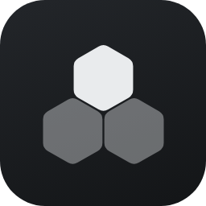

# hivemind

A workspace for coding agents, on Linux and macOS. Run them next to the terminals, editors
and diffs they are working on, grouped by repository, git worktree or SSH host.

[Documentation](https://hivemind.griiken.com/guide/) · [Install](#install) · [Releases](https://github.com/dip497/hivemind/releases) · MIT


<sub>An issue board and the live diff of a fix, side by side. The agent edits; the diff updates as you watch.</sub>

## What it is

One infinite canvas per repository. Every tile on it is live: a terminal running an
agent, a diff that updates as the agent edits, a file tree, an editor, an issues board,
a web browser. Group tiles into frames, bind each frame to a repository, a git worktree
or an SSH host, and several agents work in parallel without reaching into each other's
directories.

Issues, acceptance criteria, cycles and an activity log are markdown files with YAML
frontmatter under `.hivemind/` in your own repository. No database, no account. Agents
read and write them through the `hive` CLI, so a change lands in the board while you
watch.

## Install

Linux x86_64 and macOS Apple Silicon have prebuilt releases, so you need no toolchain.
Intel macs and Linux arm64 build from source with `--dev`. Windows builds in CI but
nothing is published: nobody has confirmed the app launches.

```bash
bash <(curl -fsSL https://hivemind.griiken.com/install.sh)
```

It resolves the latest release, puts the `hive` CLI and the app under `~/.hivemind-app/`,
links `hive` and a `hivemind` launcher into `~/.local/bin/`, and registers the app with
your desktop. Re-run it to upgrade; pin a version with `HIVEMIND_VERSION=v1.0.0`.

The macOS release is ad-hoc signed rather than notarized, so the installer strips the
quarantine attribute. Install the `.app` by hand and Gatekeeper will call it damaged
until you do the same:

```bash
xattr -dr com.apple.quarantine ~/.hivemind-app/hivemind.app
```

## Quick start

```bash
cd ~/my-project
hive init --prefix MYP          # .hivemind/config.yaml + the agent skills
hive new "Fix token expiry comparison"
hivemind .
```

In the canvas, `1`–`7` spawn a terminal, an agent, an explorer, a diff, the issues
board, a frame or a browser. Click **Work** on an issue and the agent starts with that
issue and the `hive` skills already loaded. `⌘L` opens the layers rail, `⌘E` switches
view.

## Bring your own agent

An agent is a manifest: a file naming the command to run and how to read that command's
screen. The ones in the box are written in that format and pass exactly the checks yours
does, so there is no privileged tier and nothing to fork.

```bash
hive agents validate ./my-agent    # what a user will be told about it
hive agents install ./my-agent     # from a folder
hive agents install owner/repo     # or straight from a repository
```

Before anything installs, hivemind says in plain words what it will do: the command it
runs, any directory it reads, whether it can reach the other agents on your canvas. An
agent added automatically, because its CLI turned up on your machine, may do none of
those. See [adding an agent](https://hivemind.griiken.com/guide/agent-providers/).

## Views

A view draws the whole workspace. Canvas and Windows ship; anything else you install
from the catalog or write yourself, against a sandboxed API with no access to files, the
network or the app. Switching never touches a session — tile bodies are mounted once and
lent to whichever view is on screen. See [views](https://hivemind.griiken.com/guide/views/).

## How agents drive the canvas

`hive ctl` is one vocabulary for every runtime, over a local `0600` socket. An agent in
one tile can spawn another, send it work, read its reply, pipe several together, and
broker a worker's permission prompts back to itself. What a runtime cannot do is refused
with an exit code rather than left to time out. There is no MCP server to run.

See [agent workflows](https://hivemind.griiken.com/guide/agent-workflows/) and the
[CLI reference](https://hivemind.griiken.com/guide/cli/).

## Where things live

```text
.hivemind/                              # in YOUR repo
├── issues/      <ID>.md (YAML frontmatter)  ← the source of truth
├── cycles/      sprint definitions
└── config.yaml  workspace prefix, next id

apps/
├── cli/         the hive CLI; `hive ctl` is the agent control plane
└── desktop/     Electron + React
                 ├─ Canvas       xyflow infinite canvas
                 ├─ TerminalTile xterm.js + WebGL + the agent-status bus
                 ├─ DiffTile     diff and review
                 ├─ EditorTile   CodeMirror tabs
                 ├─ IssuesTile   the issues board
                 ├─ BrowserTile  multi-tab webview + CDP bridge
                 ├─ FrameNode    repository / worktree / remote zones
                 ├─ main/remote/ ssh2 transport — remote PTY, SFTP, git
                 └─ pty-daemon   detached node-pty + screen snapshots

packages/
├── hive-core/     storage, parsing, skill templates
├── hive-agents/   the agent catalog — one manifest per agent
└── hive-view-sdk/ the API a view plugin is written against
```

Your settings are one file you own: `$XDG_CONFIG_HOME/hivemind/settings.json`
(`$HIVE_SETTINGS` overrides it). Terminals outlive the window — a detached PTY daemon
keeps them running and replays the current screen on reopen, and a `claude` session
resumes after a reboot because the spawn bound its session id.

Ideas borrowed: [Plane](https://plane.so) for issues and cycles,
[tldraw](https://tldraw.com) and Figma for frame-as-workspace,
[tmux](https://github.com/tmux/tmux) for detach-keeps-alive,
[Pierre](https://pierre.co) for a diff that belongs in the canvas.

## Development

```bash
git clone https://github.com/dip497/hivemind.git
cd hivemind && pnpm install

pnpm --filter @hivemind/desktop run dev          # the app, reloading
pnpm --filter @hivemind/cli run dev <subcommand> # the CLI
pnpm --filter @hivemind/desktop run test:unit    # node:test
pnpm --filter @hivemind/desktop run test:e2e     # playwright under xvfb
pnpm --filter @hivemind/desktop run typecheck
```

The renderer-only loop (`run dev:bridge -- /path/to/repo`, on
[localhost:5180](http://localhost:5180/)) must run under `tsx`, not bun: bun's loader
silently drops `@lydell/node-pty` output on Linux. It guards against starting under bun.

## Contributing

Issues and pull requests are welcome. `pnpm typecheck` and the unit tests should pass
before you open one; the e2e suite needs a quiet machine. See
[contributing](https://hivemind.griiken.com/guide/contributing/).

## License

MIT. See [LICENSE](./LICENSE).
